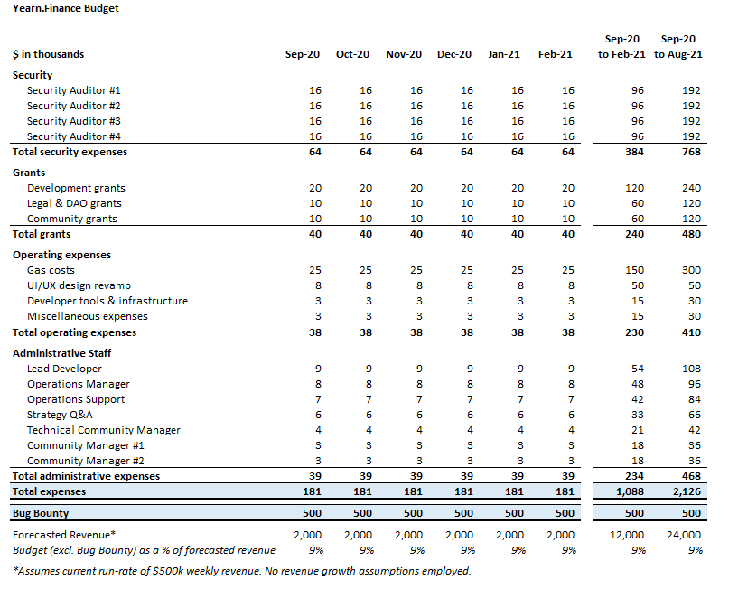
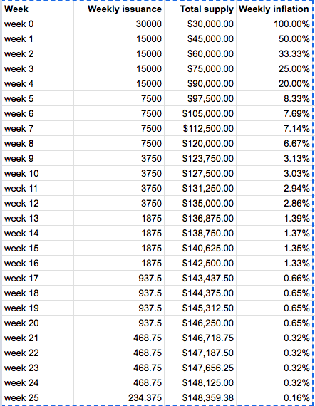
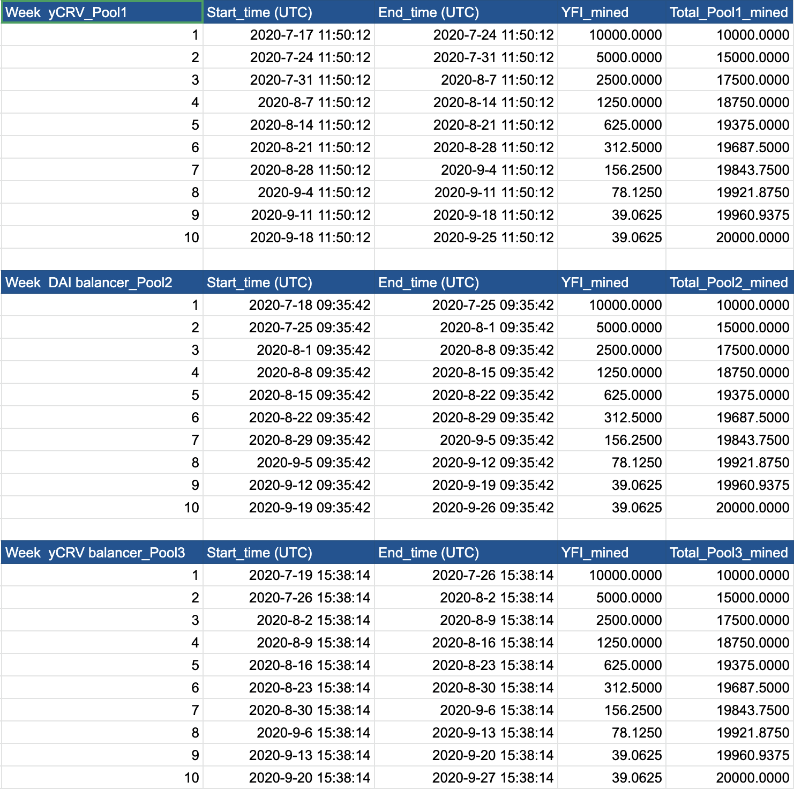

\newline
---
yip: 0
title: YIP Purpose and Guidelines
status: Implemented
author: yEarn Community
discussions-to: https://gov.yearn.finance/
created: 2020-07-22
updated: N/A
---

## What is an YIP?

YIP stands for yEarn Improvement Proposal, it has been adapted from the SIP (Synthetix Improvement Proposal). The purpose of this process is to ensure changes to yEarn are transparent and well governed. An YIP is a design document providing information to the yEarn community about a proposed change to the system. The author is responsible for building consensus within the community and documenting dissenting opinions.

## YIP Rationale

We intend YIPs to be the primary mechanisms for proposing new features, collecting community input on an issue, and for documenting the design decisions for changes to yEarn. Because they are maintained as text files in a versioned repository, their revision history is the historical record of the feature proposal.

It is highly recommended that a single YIP contain a single key proposal or new idea. The more focused the YIP, the more successful it is likely to be.

An YIP must meet certain minimum criteria. It must be a clear and complete description of the proposed enhancement. The enhancement must represent a net improvement.

## YIP Work Flow

Parties involved in the process are the *author*, the [*YIP editors*](#yip-editors), and the yEarn community.

:warning: Before you begin, vet your idea, this will save you time. Ask the yEarn community first if an idea is original to avoid wasting time on something that will be rejected based on prior research (searching the Internet does not always do the trick). It also helps to make sure the idea is applicable to the entire community and not just the author. Just because an idea sounds good to the author does not mean it will have the intend effect. The appropriate public forum to gauge interest around your YIP is [the unofficial yEarn Discord] or [the unofficial yEarn Telegram].

Your role as the champion is to write the YIP using the style and format described below, shepherd the discussions in the appropriate forums, and build community consensus around the idea. Following is the process that a successful YIP will move along:

```
[ WIP ] -> [ PROPOSED ] -> [ APPROVED ] -> [ IMPLEMENTED ] X [ REJECTED ]
```

Each status change is requested by the YIP author and reviewed by the YIP editors. Use a pull request to update the status. Please include a link to where people should continue discussing your YIP. The YIP editors will process these requests as per the conditions below.

* **Work in progress (WIP)** -- Once the champion has asked the yEarn community whether an idea has any chance of support, they will write a draft YIP as a [pull request]. Consider including an implementation if this will aid people in studying the YIP.
* **Proposed** If agreeable, YIP editor will assign the YIP a number (generally the issue or PR number related to the YIP) and merge your pull request. The YIP editor will not unreasonably deny an YIP. Proposed YIPs will be discussed on governance calls and in Discord. If there is a reasonable level of consensus around the change on the governance call the change will be moved to approved. If the change is contentious a vote of token holders may be held to resolve the issue or approval may be delayed until consensus is reached.
* **Approved** -- This YIP has passed community governance and is now being prioritised for development.
* **Implemented** -- This YIP has been implemented and deployed to mainnet.
* **Rejected** -- This YIP has failed to reach community consensus.

## What belongs in a successful YIP?

Each YIP should have the following parts:

- Preamble - RFC 822 style headers containing metadata about the YIP, including the YIP number, a short descriptive title (limited to a maximum of 44 characters), and the author details.
- Simple Summary - “If you can’t explain it simply, you don’t understand it well enough.” Provide a simplified and layman-accessible explanation of the YIP.
- Abstract - a short (~200 word) description of the technical issue being addressed.
- Motivation (*optional) - The motivation is critical for YIPs that want to change yEarn. It should clearly explain why the existing specification is inadequate to address the problem that the YIP solves. YIP submissions without sufficient motivation may be rejected outright.
- Specification - The technical specification should describe the syntax and semantics of any new feature.
- Rationale - The rationale fleshes out the specification by describing what motivated the design and why particular design decisions were made. It should describe alternate designs that were considered and related work, e.g. how the feature is supported in other languages. The rationale may also provide evidence of consensus within the community, and should discuss important objections or concerns raised during discussion.
- Test Cases - Test cases may be added during the implementation phase but are required before implementation.
- Copyright Waiver - All YIPs must be in the public domain. See the bottom of this YIP for an example copyright waiver.

## YIP Formats and Templates

YIPs should be written in [markdown] format.
Image files should be included in a subdirectory of the `assets` folder for that YIP as follows: `assets/yip-X` (for yip **X**). When linking to an image in the YIP, use relative links such as `../assets/yip-X/image.png`.

## YIP Header Preamble

Each YIP must begin with an [RFC 822](https://www.ietf.org/rfc/rfc822.txt) style header preamble, preceded and followed by three hyphens (`---`). This header is also termed ["front matter" by Jekyll](https://jekyllrb.com/docs/front-matter/). The headers must appear in the following order. Headers marked with "*" are optional and are described below. All other headers are required.

` yip:` <YIP number> (this is determined by the YIP editor)

` title:` <YIP title>

` author:` <a list of the author's or authors' name(s) and/or username(s), or name(s) and email(s). Details are below.>

` * discussions-to:` \<a url pointing to the official discussion thread at gov.yearn.finance\>

` status:` < WIP | PROPOSED | APPROVED | IMPLEMENTED >

` created:` <date created on>

` * updated:` <comma separated list of dates>

` * requires:` <YIP number(s)>

` * resolution:` \<a url pointing to the resolution of this YIP\>

Headers that permit lists must separate elements with commas.

Headers requiring dates will always do so in the format of ISO 8601 (yyyy-mm-dd).

#### `author` header

The `author` header optionally lists the names, email addresses or usernames of the authors/owners of the YIP. Those who prefer anonymity may use a username only, or a first name and a username. The format of the author header value must be:

> Random J. User &lt;address@dom.ain&gt;

or

> Random J. User (@username)

if the email address or GitHub username is included, and

> Random J. User

if the email address is not given.

#### `discussions-to` header

While an YIP is in WIP or Proposed status, a `discussions-to` header will indicate the URL at [gov.yearn.finance](https://gov.yearn.finance/) where the YIP is being discussed.

#### `created` header

The `created` header records the date that the YIP was assigned a number. Both headers should be in yyyy-mm-dd format, e.g. 2001-08-14.

#### `updated` header

The `updated` header records the date(s) when the YIP was updated with "substantial" changes. This header is only valid for YIPs of Draft and Active status.

#### `requires` header

YIPs may have a `requires` header, indicating the YIP numbers that this YIP depends on.

## Auxiliary Files

YIPs may include auxiliary files such as diagrams. Such files must be named YIP-XXXX-Y.ext, where “XXXX” is the YIP number, “Y” is a serial number (starting at 1), and “ext” is replaced by the actual file extension (e.g. “png”).

## YIP Editors

The current YIP editors are:

` * Artem K (@banteg)`

` * Cooper Turley (@Cooopahtroopa)`

` * Daryl Lau (@Daryllautk)`

` * Klim K (@milkyklim)`

` * Sunil Srivatsa (@alphastorm)`

## YIP Editor Responsibilities

For each new YIP that comes in, an editor does the following:

- Read the YIP to check if it is ready: sound and complete. The ideas must make technical sense, even if they don't seem likely to get to final status.
- The title should accurately describe the content.
- Check the YIP for language (spelling, grammar, sentence structure, etc.), markup (Github flavored Markdown), code style

If the YIP isn't ready, the editor will send it back to the author for revision, with specific instructions.

Once the YIP is ready for the repository, the YIP editor will:

- Assign an YIP number (generally the PR number or, if preferred by the author, the Issue # if there was discussion in the Issues section of this repository about this YIP)

- Merge the corresponding pull request

- Send a message back to the YIP author with the next step.

The YIP editors monitor YIP changes, and correct any structure, grammar, spelling, or markup mistakes we see.

The editors don't pass judgment on YIPs. We merely do the administrative & editorial part.

## History

The YIP document was derived heavily from the SIP Synthetix Improvement Proposal document in many places text was simply copied and modified. Any comments about the YIP document should be directed to the YIP editors.

### Bibliography

[the unofficial yEarn Discord]: https://discord.com/invite/3AGgWxy
[the unofficial yEarn Telegram]: https://t.me/yearnfinance
[pull request]: https://github.com/iearn-finance/YIPS/pulls
[markdown]: https://github.com/adam-p/markdown-here/wiki/Markdown-Cheatsheet

## Copyright

Copyright and related rights waived via [CC0](https://creativecommons.org/publicdomain/zero/1.0/).
\newline
---
yip: 1
title: Minting more YFI
status: Implemented
author: Andre Cronje (@andrecronje)
discussions-to: https://gov.yearn.finance/t/proposal-0-yfi-supply/24
created: 2020-07-19
---

## Simple Summary

**FOR**: Allows weekly distribution of YFI. A second proposal will be submitted to decide how much would be printed weekly.

**AGAINST**: No more YFI tokens will be distributed. Global supply is locked at 30000 YFI permanently.

*NOTE: This was proposal 0 on-chain.*

## Metadata

| Name                | Value                                      |
|---------------------|--------------------------------------------|
| Proposed by         | 0x473afAb58B2C5D4DbC5FAD5D236f6658AD84E83b |
| Total for votes     | 7734007.4689 (61.02%)                      |
| Total against votes | 4939315.7347 (38.97%)                      |
| Quorum              | 62.68% ✔                                   |
| Start block         | 10490942                                   |
| End block           | 10508222                                   |

Source: [yieldfarming.info YFI Governance Information](https://yieldfarming.info/yearn/vote/)

## Copyright
Copyright and related rights waived via [CC0](https://creativecommons.org/publicdomain/zero/1.0/).
\newline
---
yip: 10
title: Transitionary YFI Only Voting
status: Implemented
author: Rewkang (@rewkang)
discussions-to: https://gov.yearn.finance/t/yip-10-transitionary-yfi-only-voting/481
created: 2020-07-24
implementation: https://etherscan.io/address/0xBa37B002AbaFDd8E89a1995dA52740bbC013D992
---

## Simple Summary
<!--"If you can't explain it simply, you don't understand it well enough." Simply describe the outcome the proposed changes intends to achieve. This should be non-technical and accessible to a casual community member.-->
The current yEarn governance mechanism puts the protocol at risk of a hostile takeover. The best immediate course of action would be to temporarily transition the protocol to a new voting contract recently deployed by Andre.

## Abstract
<!--A short (~200 word) description of the proposed change, the abstract should clearly describe the proposed change. This is what *will* be done if the YIP is implemented, not *why* it should be done or *how* it will be done. If the YIP proposes deploying a new contract, write, "we propose to deploy a new contract that will do x".-->
Update the ygov.finance voting page to link to the new voting contract where only YFI can be staked.

Contract: [Etherscan](https://etherscan.io/address/0xad7e09665caa3404d9c6525d5997a10fc6c12cfe)

## Motivation
<!--This is the problem statement. This is the *why* of the YIP. It should clearly explain *why* the current state of the protocol is inadequate.  It is critical that you explain *why* the change is needed, if the YIP proposes changing how something is calculated, you must address *why* the current calculation is innaccurate or wrong. This is not the place to describe how the YIP will address the issue!-->
The current yEarn voting contract accepts BPT (Balancer Pool Tokens) from a pool consisting of 98% yCRV / 2% YFI. This creates a dynamic where large stablecoin holders hold a disproportionate amount of voting shares and thereby governance power, while those whom have a high proportion of YFI vs. stablecoin are underrepresented in governance. Governance should be dictated by those with the most vested long term interest of the protocol - YFI holders - irrespective of their portfolio composition. More importantly, the protocol is currently vulnerable to a hostile takeover of governance by stablecoin whales who could potentially pass a proposal to mint a large supply of YFI and disproportionately reward themselves (via favoring large stablecoin holders).

There are multiple different long term governance/voting approaches being debated, and it will take time to align on community consensus. While these are being analyzed/discussed, we should immediately transition to a temporary governance structure where only YFI can be used to vote in order to mitigate hostile takeover attacks.

The community can replace this temporary YFI only voting structure after passing a new YIP.

**FOR**: Governance moves to newly deployed YFI only voting contract.

**AGAINST**: No governance changes.

## Metadata

| Name                | Value                                      |
|---------------------|--------------------------------------------|
| Proposed by         | 0x09173487b272311Edda01F45f97911aEB6aBd602 |
| Total for votes     | 13641124.8956 (77.08%)                     |
| Total against votes | 4054142.5578 (22.91%)                      |
| Quorum              | 45.92% ✔                                   |
| Start block         | 10518707                                   |
| End block           | 10535987                                   |

Source: [yieldfarming.info YFI Governance Information](https://yieldfarming.info/yearn/vote/)

## Copyright
Copyright and related rights waived via [CC0](https://creativecommons.org/publicdomain/zero/1.0/).
\newline
---
yip: 12
title: Reducing the quorum for accepting proposal
status: Implemented
author: cp287 (@illlefr4u)
discussions-to: https://gov.yearn.finance/t/yip-12-reducing-the-quorum-for-accepting-proposal/578
created: 2020-07-24
implementation: https://etherscan.io/tx/0x64ff868305c1271c51b85a4f69f547f3137bebeae611eff1e0a2d86714469b77#
---

## Simple Summary
<!--"If you can't explain it simply, you don't understand it well enough." Simply describe the outcome the proposed changes intends to achieve. This should be non-technical and accessible to a casual community member.-->
At the moment, it is difficult for the yEarn governance mechanism to achieve a quorum of 33%. For the control system to function, the threshold must be lowered so that at least some decisions can be made.

## Abstract
<!--A short (~200 word) description of the proposed change, the abstract should clearly describe the proposed change. This is what *will* be done if the YIP is implemented, not *why* it should be done or *how* it will be done. If the YIP proposes deploying a new contract, write, "we propose to deploy a new contract that will do x".-->
It is proposed to reduce the quorum threshold for accepting the proposal to 20%.
At the moment, no changes to the on-chain are necessary, since the quorum check is currently being carried out off-chain. Thus, it is enough to simply make a decision by onchain voting.

## Motivation
<!--This is the problem statement. This is the *why* of the YIP. It should clearly explain *why* the current state of the protocol is inadequate.  It is critical that you explain *why* the change is needed, if the YIP proposes changing how something is calculated, you must address *why* the current calculation is innaccurate or wrong. This is not the place to describe how the YIP will address the issue!-->
At the moment, it is difficult for the yEarn governance mechanism to achieve a quorum of 33%. We could observe this even with the important proposal 1, which could not reach the quorum.
This is due to both:

- general passivity and lack of motivation to participate in governance system;
- negative motivation to participate (lock of funds).

Thus, yEarn protocol is under the threat of forever remaining as it is, since all proposals may not reach the required quorum (with a high probability, the activity in voting will only decrease over time).

There are many different solutions, which I will describe below, and I propose to start discussing them in the topic, but it is critical now to make a simple decision that will allow the protocol to evolve, and the community to make decisions on the development of the protocol.
In my opinion, such a decision may be to reduce the quorum threshold to 20%, which I put up for voting.

Other ways to solve the quorum problem:

- you get rewards for staking only if you vote;
- delegation of votes (implementation will take some time);
- quorum should be not for ALL tokens, but for only those “escrowed” to be voting;
- should have a quorum schedule which after x amount of time with no proposal meeting quorum the threshold goes down 1%-2% for year1, 0.5%-1% for year 2, etc.

**FOR**: The threshold for accepting the proposal drops to 20%.

**AGAINST**: No change for threshold.

## Metadata

| Name                | Value                                      |
|---------------------|--------------------------------------------|
| Proposed by         | 0x74630370197b4c4795bFEeF6645ee14F8cf8997D |
| Total for votes     | 5291919.8701 (66.22%)                      |
| Total against votes | 2699427.0543 (33.77%)                      |
| Quorum              | 39.76% ✔                                   |
| Start block         | 10522307                                   |
| End block           | 10539587                                   |

Source: [yieldfarming.info YFI Governance Information](https://yieldfarming.info/yearn/vote/)

## Copyright
Copyright and related rights waived via [CC0](https://creativecommons.org/publicdomain/zero/1.0/).
\newline
---
yip: 14
title: yEarn Rewards Reserve
status: Rejected
author: YieldBouncer (@yieldbouncer)
discussions-to: https://gov.yearn.finance/t/yip-14-yearn-rewards-reserve/136
created: 2020-07-24
---

## Simple Summary
Without a cash reserve, it is difficult to sustain and improve the protocol further. As a community, we need to start capturing and reserving a percentage of the value being generated by yEarn in order to support further development, improve security, sponsor research, e.t.c.

To get started, I propose we capture 5% of all yields earned through yEarn to be used as a reserve for the protocol.

## Abstract
@andre.cronje has done an amazing job so far at developing the protocol. As a community, we should support his efforts. To achieve that, I propose that we should start reserving 5% of all yields earned for protocol use. How we plan to use it and what would be the sensible threshold for the reserve percentage can be determined in a different proposal

## Motivation
One of the best things about the yEarn ecosystem is that there isn’t any pre-mined tokens. No money was taken from VC nor did @andre.cronje attempted to IXO (e.g. IDO, ICO) YFI tokens. This is as good as we can get when it comes to decentralization for a working and profitable defi project! Unfortunately, there are also downsides for not having some cash reserved:

- Unable to cover expensive audits for contracts
- Incentive to continue building awesome products
- Fund/grants to sponsor researches in order to improve the products
- General marketing and user support

**FOR**: Reserve 5% of all yields earned through yEarn for protocol use.

**AGAINST**: No changes. All rewards will continue to distribute evenly among YFI stakers.

## Metadata

| Name                | Value                                      |
|---------------------|--------------------------------------------|
| Proposed by         | 0x09173487b272311Edda01F45f97911aEB6aBd602 |
| Total for votes     | 332839.5446 (99.69%)                       |
| Total against votes | 1005.9567 (0.30%)                          |
| Quorum              | 3.06% 𐄂                                    |
| Start block         | 10525527                                   |
| End block           | 10542807                                   |

Source: [yieldfarming.info YFI Governance Information](https://yieldfarming.info/yearn/vote/)

## Copyright
Copyright and related rights waived via [CC0](https://creativecommons.org/publicdomain/zero/1.0/).
\newline
---
yip: 2
title: Burn YFI for fees
status: Rejected
author: Andre Cronje (@andrecronje)
discussions-to: https://gov.yearn.finance/t/proposal-1-yfi-fee-collection/25
created: 2020-07-19
---

## Simple Summary

**FOR**: Will continue to with the current burn model.

**AGAINST**: Rewards will be claimed via a staking model instead.

*NOTE: This was proposal 1 on-chain.*

## Metadata

| Name                | Value                                      |
|---------------------|--------------------------------------------|
| Proposed by         | 0x473afAb58B2C5D4DbC5FAD5D236f6658AD84E83b |
| Total for votes     | 502445.8576 (11.27%)                       |
| Total against votes | 3953417.1244 (88.72%)                      |
| Quorum              | 22.03% 𐄂                                   |
| Start block         | 10490942                                   |
| End block           | 10508222                                   |

Source: [yieldfarming.info YFI Governance Information](https://yieldfarming.info/yearn/vote/)

## Copyright
Copyright and related rights waived via [CC0](https://creativecommons.org/publicdomain/zero/1.0/).
\newline
---
yip: 30
title: YFI Inflation Schedule
status: Rejected
author: Substreight (@substreight), DeltaTiger (@deltatigernz), Hannes Graah (@Graadient), Daryl Lau (@Daryllautk), yfi_whale
discussions-to: https://gov.yearn.finance/t/yip-30-yfi-inflation-schedule/1439
created: 2020-07-28
---

## Simple Summary
Implement an inflation schedule of 20,000 YFI over the next 8 years, with 12,802 distributed in the first 3 years, ending with a trailing tail of 1% inflation.

## Abstract
* Update the YFI mint contract to reflect new inflation schedule.

## Motivation
To create an inflation schedule after the passing of YIP-0.

**FOR**: Implement an inflation schedule of 20,000 YFI over the next 8 years, with 12,802 distributed in the first 3 years, ending with a trailing tail of 1% inflation.

**AGAINST**: No changes.

## Specification

### Overview
1. Adjust supply schedule to follow [[YFI Inflation Schedule](https://docs.google.com/spreadsheets/d/1yomUGpAWR8svL9RXD-_vL2ArgQPGj1x2XPNKDEuZR9Q/edit?usp=sharing)].
  - Beginning annual inflation: 22.384%
  - Weekly emissions reduction multiplier: 0.9937
  - Week that terminal inflation starts: 416 weeks
  - Fixed % ongoing inflation (tail emission): 1%
2. This model will stay in place until it is stopped or adjusted.

### Rationale

* Liquidity provider yields are maintained at reasonably competitive levels in various YFI price and TVL scenarios (see modeling sheet).
* Lower initial inflation (22%) to keep long-term rewards reasonable.
* 8 year emission schedule to support long-term development.

Reference: [synthetix/contracts/SupplySchedule.sol](https://github.com/Synthetixio/synthetix/blob/master/contracts/SupplySchedule.sol)

## Metadata

| Name                | Value                                      |
|---------------------|--------------------------------------------|
| Proposed by         | 0x2D407dDb06311396fE14D4b49da5F0471447d45C |
| Total for votes     | 3380.7051 (38.73%)                         |
| Total against votes | 5346.6313 (61.26%)                         |
| Quorum              | 82.39% ✔                                   |
| Start block         | 10560113                                   |
| End block           | 10577393                                   |

Source: [yieldfarming.info YFI Governance Information](https://yieldfarming.info/yearn/vote/)

## Copyright
Copyright and related rights waived via [CC0](https://creativecommons.org/publicdomain/zero/1.0/).
\newline
---
yip: 31
title: YFI Inflation Distribution
status: Rejected
author: Substreight (@substreight), DeltaTiger (@deltatigernz), Hannes Graah (@Graadient), Daryl Lau (@Daryllautk)
discussions-to: https://gov.yearn.finance/t/yip-31-yfi-inflation-distribution/1445
created: 2020-07-30
---

## Simple Summary
Divide any further YFI inflation, allocating 50% to Liquidity Pools and 50% to the Multisig.

## Abstract
* There are currently no funds being allocated to developing and improving the yearn ecosystem.
* Further inflation of YFI provides an opportunity to fulfill funding needs.

## Motivation
Using YFI from inflation to fund development is a sustainable mechanism to strengthen the yearn ecosystem and align contributors.

**FOR**: Allocate 50% of YFI inflation to Liquidity Pool incentives and 50% to the Multisig.

**AGAINST**: No changes to YFI inflation distribution.

## Specification

### Overview
* Designate 50% of future YFI emissions to LP rewards contract.
* Designate 50% of future YFI emissions to Multisig (or DAO if applicable).
* This will stay in place until stopped or adjusted.

### Rationale

Some YFI should be reserved to secure and improve the yearn ecosystem while properly incentivizing liquidity pools. Starting with a 50% // 50% split to LPs and Multisig, respectively, allows proper funding for both stakeholders, while retaining flexibility to adjust the distribution if necessary.

Reference
* Inflation schedule proposal [YIP-30](https://github.com/iearn-finance/YIPS/blob/master/YIPS/yip-30.md)

## Metadata

| Name                | Value                                      |
|---------------------|--------------------------------------------|
| Proposed by         | 0x24394A4758DBdCf6fcbC14dc35af64Ac0D9a450A |
| Total for votes     | 3304.5260 (42.28%)                         |
| Total against votes | 4509.5851 (57.71%)                         |
| Quorum              | 73.42% ✔                                   |
| Start block         | 10560736                                   |
| End block           | 10578016                                   |

Source: [yieldfarming.info YFI Governance Information](https://yieldfarming.info/yearn/vote/)

## Copyright
Copyright and related rights waived via [CC0](https://creativecommons.org/publicdomain/zero/1.0/).
\newline
---
yip: 32
title: Remove YFI burning
status: Implemented
author: Sunil Srivatsa (@alphastorm)
discussions-to: https://gov.yearn.finance/t/yip-32-remove-yfi-burning/1907
created: 2020-08-01
---

## Simple Summary
Remove YFI burning from the protocol.

## Abstract
YFI represents a claim on yEarn protocol fees. To claim fees, YFI can either be burned or staked in the governance pool.

This YIP is to decide whether or not to keep the burning mechanism.

## Motivation
It makes no sense to burn because the price of YFI will always be higher than the claimable fee value. This is because YFI represents current assets in the fee pool plus future expected cashflows. Staking is just obviously better.

**FOR**: Remove YFI burning from the protocol.

**AGAINST**: No change (start burning YFI for fees).

## Metadata

| Name                | Value                                      |
|---------------------|--------------------------------------------|
| Proposed by         | 0x74630370197b4c4795bFEeF6645ee14F8cf8997D |
| Total for votes     | 3054.9983 (97.89%)                         |
| Total against votes | 65.8346 (2.10%)                            |
| Quorum              | 24.5% ✔                                    |
| Start block         | 10576777                                   |
| End block           | 10594057                                   |

Source: [yieldfarming.info YFI Governance Information](https://yieldfarming.info/yearn/vote/)

## Copyright
Copyright and related rights waived via [CC0](https://creativecommons.org/publicdomain/zero/1.0/).
\newline
---
yip: 33
title: Add LINK to yVaults
status: Implemented
author: franklin (@franklin501)
discussions-to: https://gov.yearn.finance/t/add-link-as-the-first-asset-for-the-upcoming-delegated-yvaults-release/847
created: 2020-08-02
---

## Simple Summary

Add Chainlink (LINK) as the first volatile asset to be used as collateral in delegated yVaults.

## Abstract

Add Chainlink (LINK) as the first volatile asset to be used as collateral in delegated yVaults.

## Motivation

Delegated yVaults have initially launched with only USDC as collateral. Additional assets are necessary in order to generate more revenue for the protocol and grow the ecosystem. This proposal nominates LINK as the first volatile asset to be used as collateral. LINK was the top choice in a preliminary [poll](https://gov.yearn.finance/t/add-link-as-the-first-asset-for-the-upcoming-delegated-yvaults-release/847/7) and is a good first candidate for trials before other volatile assets are added.

**FOR**: Add LINK as the first volatile asset to be used in delegated yVaults.

**AGAINST**: Don't add LINK.

### Overview

Adding LINK as a collateral option to delegated yVaults will enable LINK holders to deposit tokens to the vault, which will increase the total value locked (TVL) and generate more fees for the protocol.

### Rationale

Chainlink is among the highest valued and most liquid ERC-20 tokens. There is a significant number of tokens and thus liquidity idle, which could be deposited for delegated yVaults. LINK’s high market capitalization makes it well suited to be the first delegated yVault volatile asset as it will likely contribute to the most fees that will be accrued the protocol.

Chainlink also has one of the strongest communities in crypto and successful initial trials of delegated yVaults will likely encourage larger token holders to join the ecosystem adding even more fees. Large deposits of LINK as collateral will significantly increase total value locked (TVL) in yVaults, compared to other token communities that are not as immersed in DeFi.

## Metadata

| Name                | Value                                      |
|---------------------|--------------------------------------------|
| Proposed by         | 0x071243c8f33A3e7c15499a8E51fF852DbaF05854 |
| Total for votes     | 3069.4359 (99.46%)                         |
| Total against votes | 16.3954 (0.53%)                            |
| Quorum              | 31.68% ✔                                   |
| Start block         | 10582615                                   |
| End block           | 10599895                                   |

Source: [yieldfarming.info YFI Governance Information](https://yieldfarming.info/yearn/vote/)

## Copyright

Copyright and related rights waived via [CC0](https://creativecommons.org/publicdomain/zero/1.0/).
\newline
---
yip: 34
title: Add Synthetix (SNX) to yVaults
status: Approved
author: Substreight (@substreight)
discussions-to: https://gov.yearn.finance/t/yip-34-add-synthetix-snx-to-yvaults/2149
created: 2020-08-06
---

## Simple Summary

Add Synthetix (SNX) as the second volatile asset to be used as collateral in delegated yVaults.

## Abstract

Add Synthetix (SNX) as the second volatile asset to be used as collateral in delegated yVaults.

## Motivation

Additional assets are necessary in order to generate more revenue for the protocol and grow the ecosystem. This proposal nominates SNX as the second volatile asset to be used as collateral. While other tokens have polled higher, the strategy for SNX has already been developed and will be quicker to launch.

**FOR**: Add SNX as the second volatile asset to be used in delegated yVaults.

**AGAINST**: Don't add SNX.

### Overview

Adding SNX as a collateral option to delegated yVaults will enable SNX holders to deposit tokens to the vault, which will increase the total value locked (TVL) and generate more fees for the protocol. 

### Rationale

Synthetix stakers currently incur regularly high gas costs when claiming minted SNX rewards on a weekly basis. With the addition of SNX to yVaults, smaller SNX holders will be able to either allow their rewards to compound or claim them on a regular basis at very low gas costs. This inclusive model will likely draw small and large SNX holders alike, further increasing AUM and driving fee generation for YFI holders. While other tokens have polled higher, the strategy for SNX has already been developed and will be quicker to launch as a vault. 

## Metadata

| Name                | Value                                      |
|---------------------|--------------------------------------------|
| Proposed by         | 0xCa845A71d1ff53E7DB7769Ae3f356AF53Fb43000 |
| Total for votes     | 4207.0774 (90.40%)                         |
| Total against votes | 446.7678 (9.59%)                           |
| Quorum              | 41.95% ✔                                   |
| Start block         | 10609260                                   |
| End block           | 10626540                                   |

Source: [yieldfarming.info YFI Governance Information](https://yieldfarming.info/yearn/vote/)

## Copyright

Copyright and related rights waived via [CC0](https://creativecommons.org/publicdomain/zero/1.0/).
\newline
---
yip: 35
title: Distribute Donations vs Purchase YFI
status: Implemented
author: Andre Cronje (@andrecronje), Klim K (@milkyklim)
discussions-to: https://gov.yearn.finance/t/distribution-donations-vs-purchasing-yfi/2244

created: 2020-08-10
---

## Simple Summary

Allow donors who donated to claim back donations or leave them to be used to purchase YFI.

## Abstract

While I am very appreciative of the donations, the [article](https://decrypt.co/37995/exclusive-yfi-andre-cronje-broke-quitting-defi) was a gross misrepresentation of our discussion. I am not in financial detriment, I do have debt, but I have assets in crypto to offset my fiat debt. I am simply not interested to swap my crypto to fiat, since I value my crypto more than fiat.

As such, I propose a small system, whereby donors can claim back their donations, should they wish. If however they do not claim it back by x date, then the funds (currently \$150,000) will be used to market buy YFI. I wish to use this YFI as a governance vote and we can also use it to incentivize other events or requirements.

## Motivation

Having spoken to donors, its a mix of “use it for the protocol” vs “it is an insult to return it”, so I wanted to come up with a new solution that benefits all participants.

**FOR**: Build the claim back and purchase system.

**AGAINST**: Return the donations.

## Specification

I will implement a simplistic contract that allows donors to reclaim, should they not wish to do so, after maturity date, YFI will be purchased and staked in governance.

## Metadata

| Name                | Value                                      |
|---------------------|--------------------------------------------|
| Proposed by         | 0x74630370197b4c4795bFEeF6645ee14F8cf8997D |
| Total for votes     | 1644.3648 (93.59%)                         |
| Total against votes | 112.4983 (6.40%)                           |
| Quorum              | 37.43% ✔                                   |
| Start block         | 10633099                                   |
| End block           | 10650379                                   |

Source: [yieldfarming.info YFI Governance Information](https://yieldfarming.info/yearn/vote/)

## Copyright

Copyright and related rights waived via [CC0](https://creativecommons.org/publicdomain/zero/1.0/).
\newline
---
yip: 36
title: System rewards as operational capital
status: Implemented
author: Andre Cronje (@andrecronje), iTo, n00b (@jchi18), Artem K (@banteg)
discussions-to: https://gov.yearn.finance/t/system-rewards-as-operational-capital/1974

created: 2020-08-10
---

## Simple Summary

Assign system rewards as operational capital for expenditures instead of streaming them to governance.

## Abstract

Cover operational expenses with no immediate issuance of YFI required.

## Motivation

The YFI community is currently working with Delphi and Gauntlet to develop an economic model and inflation schedule. Until this process is complete, the project lacks the funds for any operational expenses including, but not exclusive to, security audits, deployment costs, consulting expenses, and compensations.

But with the state of the market, the system rewards are adequately sufficient to cover operational expenses. The YIP proposes that the system rewards are directed to the multisig instead of streamed to governance stakers. This allows the multisig to cover operational expenses without minting additional YFI.

**FOR:** Use system rewards for operational expenses with \$500k treasury cap and surplus distributed to governance stakers.

**AGAINST:** Keep streaming rewards to governance stakers.

## Specification

100% of rewards collected by the system are directed to multisig treasury.

Treasury should maintain a buffer of 500,000 USD equivalent, with further rewards distributed to YFI staked in the governance pool.

All surplus rewards are directed to the governance pool.

## Metadata

| Name                | Value                                      |
|---------------------|--------------------------------------------|
| Proposed by         | 0x24394A4758DBdCf6fcbC14dc35af64Ac0D9a450A |
| Total for votes     | 2002.4442 (94.51%)                         |
| Total against votes | 116.1982 (5.48%)                           |
| Quorum              | 45.11% ✔                                   |
| Start block         | 10633194                                   |
| End block           | 10650474                                   |

Source: [yieldfarming.info YFI Governance Information](https://yieldfarming.info/yearn/vote/)

## Copyright

Copyright and related rights waived via [CC0](https://creativecommons.org/publicdomain/zero/1.0/).
\newline
---
yip: 37
title: Participate in CRV governance and 2.5x CRV reward boost
status: Implemented
author: Andre Cronje (@andrecronje), Artem K (@banteg)
discussions-to: https://gov.yearn.finance/t/pre-crv-rewards-distribution-liquidation-or-boost/2481

created: 2020-08-17
---

## Summary
Use early LP rewards to enable YFI holders to participate in Curve DAO governance and vote-lock them for 4 years to boost yVault CRV generation by up to 2.5x.

## Abstract
All vested CRV tokens earned by StrategyYfii will be vote-locked to give YFI holders voting rights in Curve DAO and to boost the rewards earned by yCRV pool.

## Motivation
yVault currently holds 609,688 CRV with 1 year linear vesting. Starting August 28th, 2020, we can leverage these rewards to increase CRV generation and greatly incentivize capital inflow into Yearn.

## Specification

### Overview
Funnel all the vested CRV into 4 year vote lock and enable delegated voting with it with YFI.

### Rationale
Forum poll snapshot:
- 80% Participate in CRV governance and 2.5x boost
- 12% Distribute to YFI treasury and holders
- 8% Distribute to yVault LPs

### Technical Specification
- Total early LP CRV rewards collected: 609688.7992009243
  - 0x8816B2Fb982281c36E6c535B9e56B7a4417e68cF = 1606.9780365084564
  - 0xBE197E668D13746BB92E675dEa2868FF14dA0b73 = 39433.37196717059
  - 0x2De055fec2b826ed4A7478CeDDBefF82C1EdFA70 = 568648.4491972453
- Vesting: from 2020-08-13 to 2021-08-13
- Unlocked per day: 1670 CRV

## Copyright
Copyright and related rights waived via [CC0](https://creativecommons.org/publicdomain/zero/1.0/).
\newline
---
yip: 38
title: Distribute / Keep Balancer Rewards
status: Implemented
author: Klim K (@milkyklim)
discussions-to: https://gov.yearn.finance/t/yip-38-distribute-keep-balancer-rewards/2436

created: 08/18/2020
---

<!--You can leave these HTML comments in your merged SIP and delete the visible duplicate text guides, they will not appear and may be helpful to refer to if you edit it again. This is the suggested template for new SIPs. Note that an SIP number will be assigned by an editor. When opening a pull request to submit your SIP, please use an abbreviated title in the filename, `sip-draft_title_abbrev.md`. The title should be 44 characters or less.-->

## Simple Summary
<!--"If you can't explain it simply, you don't understand it well enough." Simply describe the outcome the proposed changes intends to achieve. This should be non-technical and accessible to a casual community member.-->
Keep seized $BAL tokens as part of operational capital instead of distributing to old governance pool $BPT stakers.

## Abstract
<!--A short (~200 word) description of the proposed change, the abstract should clearly describe the proposed change. This is what *will* be done if the SIP is implemented, not *why* it should be done or *how* it will be done. If the SIP proposes deploying a new contract, write, "we propose to deploy a new contract that will do x".-->
~891 $BAL (~18500$) tokens were sent to one of the previous distribution pools. These tokens are seized and sitting in the multisig wallet now. We either have to distribute them or keep them for operational capital.

## Motivation
<!--This is the problem statement. This is the *why* of the SIP. It should clearly explain *why* the current state of the protocol is inadequate.  It is critical that you explain *why* the change is needed, if the SIP proposes changing how something is calculated, you must address *why* the current calculation is innaccurate or wrong. This is not the place to describe how the SIP will address the issue!-->
Since $BALs belong to BPT stakers it is essential to decide what we should do with tokens.

However, the amount of $BAL seized is 3 times lower than protocol fees generated within a week (18k vs 60k). Therefore, I propose to keep $BALs in the multisig and count them towards operational capital, rather than writing a custom claim contract – this solution saves time and gas.

## Specification
<!--The specification should describe the syntax and semantics of any new feature, there are five sections
1. Overview
2. Rationale
3. Technical Specification
4. Test Cases
5. Configurable Values
-->

### Overview
<!--This is a high level overview of *how* the SIP will solve the problem. The overview should clearly describe how the new feature will be implemented.-->
Largest staker should get ~31% (~5735$) of all $BAL tokens, see graph:

https://explore.duneanalytics.com/embed/query/7901/visualization/15749?api_key=8AAmxEmXrkxj56sw0hjDtrVbMN7jZtmsZ6SmZfFo 4

While this might sound impressive there are a bunch of small stakers eligible for less than 8$. Taking into account current gas prices, fact that people have to claim their $BAL themselves I argue that it is more reasonable to keep $BAL as operational capital for the team.

Moreover, this proposal saves time as we skip writing a custom distribution contract.

### Rationale
<!--This is where you explain the reasoning behind how you propose to solve the problem. Why did you propose to implement the change in this way, what were the considerations and trade-offs. The rationale fleshes out what motivated the design and why particular design decisions were made. It should describe alternate designs that were considered and related work. The rationale may also provide evidence of consensus within the community, and should discuss important objections or concerns raised during discussion.-->
Taking into account current gas prices, the fact that people have to claim their $BAL themselves I argue that it is more reasonable to keep $BAL as operational capital for the team.

**For:** Keep $BAL for operational capital.

**Against:** Allow stakers to claim $BAL.
\newline
---
yip: 39
title: Add Curve sBTC Pool LP-Tokens yVault
status: Approved
author: uhmpeps (@az)
discussions-to: https://gov.yearn.finance/t/proposal-add-curve-sbtc-pool-lp-tokens-yvault/3251

created: 08/23/2020
---

<!--You can leave these HTML comments in your merged SIP and delete the visible duplicate text guides, they will not appear and may be helpful to refer to if you edit it again. This is the suggested template for new SIPs. Note that an SIP number will be assigned by an editor. When opening a pull request to submit your SIP, please use an abbreviated title in the filename, `sip-draft_title_abbrev.md`. The title should be 44 characters or less.-->

## Simple Summary
<!--"If you can't explain it simply, you don't understand it well enough." Simply describe the outcome the proposed changes intends to achieve. This should be non-technical and accessible to a casual community member.-->
Capture up to $214b in AUM from BTC holders who want to passively grow their BTC holdings by using some voting power to increase sBTC pool CRV returns and create a Vault for sBTC Curve Pool LP-token holders who deposit renBTC / wBTC / sBTC in Curve Pool 6. This can generate significant goodwill from Bitcoin holders who may not be aware of other use cases for their holdings currently.

It’s the Curve sBTC pool which accepts renBTC / wBTC / sBTC which are all equally acceptable and gives the most potential rewards.
We only need to accept the LP-token which is a single token type given to depositors of any type of wrapped BTC.

## Abstract
<!--A short (~200 word) description of the proposed change, the abstract should clearly describe the proposed change. This is what *will* be done if the SIP is implemented, not *why* it should be done or *how* it will be done. If the SIP proposes deploying a new contract, write, "we propose to deploy a new contract that will do x".-->
Create a Grow Vault for sBTC Curve Pool LP-token depositors which functions almost identically to the yCRV and yYFI vault. Harvest CRV, sell it for more LP-tokens or renBTC which is then re-deposited to create, distribute and compound LP-token growth.

## Motivation
<!--This is the problem statement. This is the *why* of the SIP. It should clearly explain *why* the current state of the protocol is inadequate.  It is critical that you explain *why* the change is needed, if the SIP proposes changing how something is calculated, you must address *why* the current calculation is innaccurate or wrong. This is not the place to describe how the SIP will address the issue!-->
First big mover advantage. There is room to generate significant goodwill from bitcoin holders ($214b in potential AUM) by using our voting power to kick % rewards increase toward the sBTC pool, and to create the first fully passive mechanism for BTC holders to increase their Bitcoin holdings. Right now only the most confident BTC holders are depositing and recycling / farming CRV. This can become a black hole for BTC deposits into Curve via renBTC and LP tokens into yVault for passive returns and governance fees.

## Specification
<!--The specification should describe the syntax and semantics of any new feature, there are five sections
1. Overview
2. Rationale
3. Technical Specification
4. Test Cases
5. Configurable Values
-->

[1]

* Add a table row under the Grow Vault product, for LP-token holders who deposited funds into the Curve sBTC Pool named appropriately (don’t know what the LP token is called atm)
* When user deposits Curve sBTC LP-token, system stakes the LP-token to Curve DAO and farms CRV
* Upon receipt and sale of CRV on market, system buys either more LP-token if liquidity/pools are available, or buys renBTC or sBTC
* xBTC is then deposited back to the Curve sBTC pool, LP-tokens generated, shown in table for depositors as gains, and meanwhile LP-tokens are cycled back into Curve DAO to compound CRV generation

[2]

* Use some voting power to increase CRV return generation for BTC depositors to 50-70% to make it highly compelling for BTC holders
* Ensure the new yVault is communicated to the appropriate audiences as a viable alternative to holding a non functional pet rock with no other purpose currently.

**For:** Add Vault for sBTC Curve Pool.

**Against:** No change.
\newline
---
yip: 40
title: Replace inactive multisig signers
status: Implemented
author: cp287 (@illlefr4u), Artem K (@banteg)
discussions-to: https://gov.yearn.finance/t/change-participants-of-the-multisig-wallet/2991

created: 2020-08-24
---

## Summary

With more responsibilty for the multisig signers, four of the least active signers have decided to give up their slots for more engaged participants. This proposal replaces the four signers with new ones chosen based on activity and merit.

## Abstract

Currently executing a multisig transaction can often take up to 24 hours. With Andre’s pace of work and a rapidly changing environment, this creates problems and an unnecessary time gap. Multisig participants must be responsible, but they must also be constantly inside the project and take the necessary actions for its rapid development.

## Motivation

yEarn needs a multisig which will quickly implement the decisions made, while not violating the security of the funds under the wallet's control.

## Specification

### Overview

The following signers have given up their spots:
- Michael (Curve.fi)
- Cooper Turley
- Calvin Liu
- Damir Bandalo

After careful consideration and voting, we suggest these four nominees:
- Joe Mahon (Substreight)
- Tarun Chitra (Gauntlet)
- Vasiliy Shapovalov (p2p.org)
- Mariano Conti (ex-MakerDAO)

### Rationale

We need a strong and responsive protocol multisig which can figure stuff out when some of the members are not immediately available. See also the dicussion links for activity stats and further rationale.

### Technical Specification

To execute the transition we don't need to change the threshold, just execute 8 sequential multisig transactions:

1. Add 0x6E83d6f57012D74e0F131753f8B5Ab557824507D (Vasily)
2. Remove 0xFe45baf0F18c207152A807c1b05926583CFE2e4b (Michael)
3. Add 0x6F2A8Ee9452ba7d336b3fba03caC27f7818AeAD6 (Mariano)
4. Remove 0x59171b87817C5F07157066Bd5284707A711229B3 (Cooper)
5. Add 0x07425B7a76a52dE36dFA313E13E9E3a8DBC476CF (Tarun)
6. Remove 0xb0325DbE7fA891436E83A094f9F12848c78e449b (Calvin)
7. Add 0x50B0C406a5C1fC492F84c3F3D4552391cF4672f2 (Substreight)
8. Remove 0xa83838221278f22ee5bAe3E523f34D42b066D67D (Damir)

## Discussion

https://gov.yearn.finance/t/change-participants-of-the-multisig-wallet/2991

https://gov.yearn.finance/t/nominate-yourself-for-the-foundation-model/3166
\newline
---
yip: 41
title: Temporarily Empower Multisig
status: Approved
author: tracheopteryx (@tracheopteryx), Joe Mahon (@Substreight), franklin501 (@franklin501), Michael Anderson, Vance Spencer
discussions-to: https://gov.yearn.finance/t/empower-the-multisig/2891

created: 2020-08-24
---

## Summary
Temporarily empower the Multisig members to make basic, limited operational decisions including budgetary expenditures, protocol grants, and hiring for six months, as we prepare a more robust governance architecture.

## Abstract
The proposed change would allow Multisig members to make personnel & budgetary decisions for no more than six (6) months. Any budget is to be proposed to governance for approval. This change would allow operational decisions to be made at a rapid pace for the next six (6) months. During this six-month term, the Multisig will be responsible for facilitating the creation and transition to a multi-DAO structure. These powers, as well as members of the Multisig, can be removed or modified by governance at any time.

## Motivation
In this nascent stage of Yearn's lifetime, it is crucial to make rapid decisions in order to establish a strong foundation. Structure and support needs to be quickly built around Andre’s development speed in order to ensure the success of the protocol. This proposal formalizes administrative roles that will serve as a foundation for the protocol’s transition to a multi-DAO structure in the near term. 

## Specification

### Overview
This proposal grants the Multisig operational authority on the following decisions for six (6) months from implementation: 
- Determining and distributing protocol grants.
- Determining and distributing community grants.
- Determining and distributing legal + DAO consultation grants. 
- Identifying and executing key hires listed on the attached budget.
- Identifying and engaging security firms. 
- Identifying and engaging analytical firms. 
- Continue executing yVault strategy changes until a dedicated team can take over.
- Facilitating UI & front-end development.
- Facilitating business development and integrations. 

This proposal does not grant the Multisig: 
- Authority over YFI token or emissions.
- Leadership powers beyond those described above.
- Any powers over the YIP process or governance.
- Authority over the composition of the Multisig group -- any changes to Multisig signers will need to be approved by governance.
- The power to ignore or hinder any approved YIPs or the governance process in general.
- The power to create a legal entity.

### Rationale
Forum Poll (202 votes)
- 78% “Yes, empower the Multisig”
- 22% “No, find a better solution”

Important objections raised in the forum poll argued against moving to a foundation model and overly centralizing powers. Here is how we’re learning and adjusting from this feedback:
- Clarification that this proposal is not for a foundation model and that the yearn governance DAO will retain its dominant authority including the ability to modify or     remove the multisig’s members or powers via future on-chain votes.
- A deeper discussion about decentralization, governance, and the urgency for this YIP to pass can be found in this thread: [Understanding Decentralization & Prioritizing an Operations Team](https://gov.yearn.finance/t/understanding-decentralization-prioritizing-an-operations-team/3396).
- Clearer limitations on the multisig’s authority detailed above to be controlled via smart contract.

### Technical Specification

**For:** Empower the Multisig for six (6) months.

**Against:** No changes.

### Proposed Budget


## Copyright
Copyright and related rights waived via [CC0](https://creativecommons.org/publicdomain/zero/1.0/).
\newline
---
yip: 42
title: Add RenBTC to yVaults
status: Rejected
author: Azeem (@zu-ctrl)
discussions-to: https://gov.yearn.finance/t/proposal-yrenbtc-delegated-vault/3470
implementation: https://github.com/zu-ctrl/yfi-str-pub/blob/master/StrategyCreamRENBTC.sol
created: 08/26/2020
---
<!--You can leave these HTML comments in your merged SIP and delete the visible duplicate text guides, they will not appear and may be helpful to refer to if you edit it again. This is the suggested template for new SIPs. Note that an SIP number will be assigned by an editor. When opening a pull request to submit your SIP, please use an abbreviated title in the filename, `sip-draft_title_abbrev.md`. The title should be 44 characters or less.-->

## Simple Summary
<!--"If you can't explain it simply, you don't understand it well enough." Simply describe the outcome the proposed changes intends to achieve. This should be non-technical and accessible to a casual community member.-->
Add RenBTC as a volatile asset to be used as collateral in delegated yVaults.

## Abstract
<!--A short (~200 word) description of the proposed change, the abstract should clearly describe the proposed change. This is what *will* be done if the SIP is implemented, not *why* it should be done or *how* it will be done. If the SIP proposes deploying a new contract, write, "we propose to deploy a new contract that will do x".-->

Add RenBTC as a volatile asset to be used as collateral in delegated yVaults.

## Motivation
<!--This is the problem statement. This is the *why* of the SIP. It should clearly explain *why* the current state of the protocol is inadequate.  It is critical that you explain *why* the change is needed, if the SIP proposes changing how something is calculated, you must address *why* the current calculation is innaccurate or wrong. This is not the place to describe how the SIP will address the issue!-->
wBTC has pretty good growth rates as seen on DeFi Pulse but as a custodial solution is hampered by trust-based systems which BTC holders do not by and large feel comfortable with.

RenBTC is a tokenized representation of BTC on the Ethereum blockchain. It is an ERC20, and backed 1:1 with real BTC locked in RenVM, a decentralized custodian. It is redeemable at any time for real BTC.

When Curve created an opportunity for RenBTC to generate returns, the RenVM TVL growth chart exploded. This is a clear signal that when the right solution is available, there is a LOT of BTC waiting on the sidelines to jump into farming yield on ETH. Let’s be there for them.

Refer to thread with an overwhelming majority FOR the BTC strategic focus. This is a vote to approve the current Strategy Smart contract to go live and start generating returns for RenBTC depositors without forcing them to figure out Curve deposits. 

## Specification
<!--The specification should describe the syntax and semantics of any new feature, there are five sections-->
The strategy linked to above models the current yYFI yVault strategy of farming CREAM and generating returns in more CREAM. We will require a new row in the yVault to accept RenBTC deposits. 

> Strategy 1:
* Add a new Vault row in Table for yRenBTC Vault
* User deposits RenBTC start farming CREAM the same way as yYFI Vault, and deliver returns for depositors as RenBTC.

**For:** Yes! Add yRenBTC Vault Strategy 1 - StrategyCreamRENBTC

**Against:** No change.

## Copyright
Copyright and related rights waived via [CC0](https://creativecommons.org/publicdomain/zero/1.0/).

\newline
---
yip: 43
title: Improve YIP categories
status: Rejected
author: sam bacha <sam@freighttrust.com>
discussions-to: https://gov.yearn.finance/t/proposal-add-new-statuses-to-yip-proposals-non-protocol-change/3608

created: 2020-08-24
---


## Simple Summary
<!--"If you can't explain it simply, you don't understand it well enough." Simply describe the outcome the proposed changes intends to achieve. This should be non-technical and accessible to a casual community member.-->

Add new `status`(s) to `YIPs` so that author(s) may better manage their `YIPs` in the context of community collaboration and so that governance is given the proper procedures to foster community cooperation.

## Abstract
<!--A short (~200 word) description of the proposed change, the abstract should clearly describe the proposed change. This is what *will* be done if the YIP is implemented, not *why* it should be done or *how* it will be done. If the YIP proposes deploying a new contract, write, "we propose to deploy a new contract that will do x".-->


This will *only* add to the current state of `proposal YIPs` in that it only changes the _potential_ `statuses` available of a `YIP`. It does not add any `protocol` changes: only documentation and governance procedures (off chain only).

I proposal the following changes to reflect a new state of possible 'YIPs':

1. Modifying YIP Templates
2. Modifying YIP Validator Gemfile
3. Modifying YIP README file


## Motivation
<!--This is the problem statement. This is the *why* of the YIP. It should clearly explain *why* the current state of the protocol is inadequate.  It is critical that you explain *why* the change is needed, if the YIP proposes changing how something is calculated, you must address *why* the current calculation is inaccurate or wrong. This is not the place to describe how the YIP will address the issue!-->
> The current state of procedures for `YIPS` is inadequate as it unnecessarily limits the possible outcomes of a proposed `YIP` while not affording both the author(s) nor the governance council flexibility in being able to deal with community driven `YIPs`

This is a *documentation* and *procedure* change. In fact there is no explicit description for proposing such changes in governance *(that I could find).*

This change is needed as it better explains the *intent* of the YIP format to author(s). It also provides for governance additional functionality in their procedures so as to not potentially 'alienate' author(s) by rejecting a YIP when it could have been withdrawn. This ensures that also the author(s) are active in the process of their submitted proposal and in the larger community (in so far as they are knowledgable about other potentially competing YIPS.)

## Specification

*Additions in 'BOLD'*

Proposed - a YIP that is ready to be reviewed in a governance call.
Approved - a YIP that has been accepted for implementation by the yEarn community.
Implemented - a YIP that has been released to mainnet.
Rejected - a YIP that has been rejected.
**Withdrawn - a YIP that has been withdrawn by the author(s).**
**Deferred - a YIP that governance has decided to wait for another YIP/some other change that should be bundled with it together**
**Moribund - a YIP that was once Implemented. It is now Obsolete 'AND' requires no explicit replacement.**

The "Withdrawn" status is similar - it means that the YIP author has decided that the YIP is actually a 'bad' idea, or has accepted that a competing proposal is a better alternative.


### Workflow Specification
```
Proposed -> Approved -> Implemented
  ^                     |
  +----> Rejected       +----> Moribund
  |
  +----> Withdrawn
  v
Deferred
```


#### New Statuses for YIPs 

> To be added are the following

- Withdrawn
- Moribund
- Deferred


### Overview
<!--This is a high level overview of *how* the YIP will solve the problem. The overview should clearly describe how the new feature will be implemented.-->

#### New YIP statuses
- Withdrawn
Means that the YIP author has decided that the YIP is actually a bad idea, or has accepted that a competing proposal is a better alternative.
- Moribund
Obsolete and requires no explicit replacement, it SHOULD be marked "Moribund"
- Deferred
Governance placed status upon a YIP that means that they would like to know more information, or that they would like to see if the author(s) can work with another proposed YIP and combine it into a single YIP, etc.


### Rationale

The reasoning behind this is that it is unclear what will happen to a YIP should material facts change during its initial formal proposal and when its actually voted on by governance. Changes may be introduced between then, and the author may want to withdraw the proposal. This also frees up the governance council in that they are no longer obligated to reject every single YIP that may no longer be relevant, instead sharing the responsibility with the actual author(s). 

### Technical Specification
<!--
NOTE: NO PROTOCOL CHANGES ARE PROPOSED 
THE ONLY TECHNICAL CHANGES ARE IN THE RUBY VALIDATION PROCESS FOR YIPS
-->
Technical implementation involves:

* changes in the validation Gemfile 
* changes in the template `.md` file

#### Changes in Template `.md` file

Below is a sample `.yaml` file to illustrate the _new_ header that should be used in the `yip-template.md` file

```yaml
---
YIP: <YIP number>
Title: <YIP title>
Author: < firstName, lastName, @githubUsrName, contact@address.com >
Type: <Informational | Standards Track>
Status: <WIP | Proposed | Approved | Deferred | Withdrawn | Rejected |
           Implemented | Replaced | Moribund>
    Version: <major>[.<minor>]
    Created: <date created on, in ISO 8601 (yyyy-mm-dd) format>
    Requires (*optional): <YIP number(s)>
    Implementation (*optional): <Added if YIP passes>

Discussions-to: <Create a new thread on https://gov.yearn.finance/ and drop the link here>

* Requires: <YIP numbers>
* Replaces: <YIP numbers>
* Replaced-By: <YIP number>
---
```

#### YIP Validator (Ruby Gem)

> current version: `1.0.2`, should be bumped to `1.1.0`
Changes located [github.com/iearn-finance/yip_validator/blob/master/lib/yip_validator/validator.rb#L25](https://github.com/iearn-finance/yip_validator/blob/master/lib/yip_validator/validator.rb#L25)

```ruby
    validates_inclusion_of :status, in: ['WIP', 'Proposed', 'Approved', 'Implemented', 'Rejected']
```
```ruby
    validates_inclusion_of :status, in: ['WIP', 'Proposed', 'Approved', 'Implemented', 'Rejected', 'Withdrawn', 'Deferred', 'Moribund']
```

See Files Changed here [https://github.com/sambacha/yip_validator/tree/YIP-Proposed](https://github.com/sambacha/yip_validator/tree/YIP-Proposed)

### Test Cases

See `travis-ci` logs for the `Rub Gem` update here [https://travis-ci.com/github/sambacha/yip_validator/builds/181226022](https://travis-ci.com/github/sambacha/yip_validator/builds/181226022)

```bash
total:2, valid:2, invalid:0, errors:0
	statuses: [["Withdrawn", 1], ["Implemented", 1]]
  raises exception if it includes invalid yips
spec/fixtures/invalid/yip-7.md is NOT valid:	 {:status=>["is not included in the list"]}

```

## Copyright
Copyright and related rights waived via [CC0](https://creativecommons.org/publicdomain/zero/1.0/).
\newline
---
yip: 44
title: Improve YIP categories
status: Proposed
author: sam bacha <sam@freighttrust.com>
discussions-to: https://gov.yearn.finance/t/yip-44-improve-yip-categories/3608

created: 2020-08-31
---


## Simple Summary
<!--"If you can't explain it simply, you don't understand it well enough." Simply describe the outcome the proposed changes intends to achieve. This should be non-technical and accessible to a casual community member.-->

Add new `status`(s) to `YIPs` so that author(s) may better manage their `YIPs` in the context of community collaboration and so that governance is given the proper procedures to foster community cooperation.

## Abstract
<!--A short (~200 word) description of the proposed change, the abstract should clearly describe the proposed change. This is what *will* be done if the YIP is implemented, not *why* it should be done or *how* it will be done. If the YIP proposes deploying a new contract, write, "we propose to deploy a new contract that will do x".-->


This will *only* add to the current state of `proposal YIPs` in that it only changes the _potential_ `statuses` available of a `YIP`. It does not add any `protocol` changes: only documentation and governance procedures (off chain only).

I proposal the following changes to reflect a new state of possible 'YIPs':

1. Modifying YIP Templates
2. Modifying YIP Validator Gemfile
3. Modifying YIP README file


## Motivation
<!--This is the problem statement. This is the *why* of the YIP. It should clearly explain *why* the current state of the protocol is inadequate.  It is critical that you explain *why* the change is needed, if the YIP proposes changing how something is calculated, you must address *why* the current calculation is inaccurate or wrong. This is not the place to describe how the YIP will address the issue!-->
> The current state of procedures for `YIPS` is inadequate as it unnecessarily limits the possible outcomes of a proposed `YIP` while not affording both the author(s) nor the governance council flexibility in being able to deal with community driven `YIPs`

This is a *documentation* and *procedure* change. In fact there is no explicit description for proposing such changes in governance *(that I could find).*

This change is needed as it better explains the *intent* of the YIP format to author(s). It also provides for governance additional functionality in their procedures so as to not potentially 'alienate' author(s) by rejecting a YIP when it could have been withdrawn. This ensures that also the author(s) are active in the process of their submitted proposal and in the larger community (in so far as they are knowledgable about other potentially competing YIPS.)

## Specification

*Additions in 'BOLD'*

Proposed - a YIP that is ready to be reviewed in a governance call.
Approved - a YIP that has been accepted for implementation by the yEarn community.
Implemented - a YIP that has been released to mainnet.
Rejected - a YIP that has been rejected.
**Withdrawn - a YIP that has been withdrawn by the author(s).**
**Deferred - a YIP that governance has decided to wait for another YIP/some other change that should be bundled with it together**
**Moribund - a YIP that was once Implemented. It is now Obsolete 'AND' requires no explicit replacement.**

The "Withdrawn" status is similar - it means that the YIP author has decided that the YIP is actually a 'bad' idea, or has accepted that a competing proposal is a better alternative.


### Workflow Specification
```
Proposed -> Approved -> Implemented
  ^                     |
  +----> Rejected       +----> Moribund
  |
  +----> Withdrawn
  v
Deferred
```


#### New Statuses for YIPs 

> To be added are the following

- Withdrawn
- Moribund
- Deferred


### Overview
<!--This is a high level overview of *how* the YIP will solve the problem. The overview should clearly describe how the new feature will be implemented.-->

#### New YIP statuses
- Withdrawn
Means that the YIP author has decided that the YIP is actually a bad idea, or has accepted that a competing proposal is a better alternative.
- Moribund
Obsolete and requires no explicit replacement, it SHOULD be marked "Moribund"
- Deferred
Governance placed status upon a YIP that means that they would like to know more information, or that they would like to see if the author(s) can work with another proposed YIP and combine it into a single YIP, etc.


### Rationale

The reasoning behind this is that it is unclear what will happen to a YIP should material facts change during its initial formal proposal and when its actually voted on by governance. Changes may be introduced between then, and the author may want to withdraw the proposal. This also frees up the governance council in that they are no longer obligated to reject every single YIP that may no longer be relevant, instead sharing the responsibility with the actual author(s). 

### Technical Specification
<!--
NOTE: NO PROTOCOL CHANGES ARE PROPOSED 
THE ONLY TECHNICAL CHANGES ARE IN THE RUBY VALIDATION PROCESS FOR YIPS
-->
Technical implementation involves:

* changes in the validation Gemfile 
* changes in the template `.md` file

#### Changes in Template `.md` file

Below is a sample `.yaml` file to illustrate the _new_ header that should be used in the `yip-template.md` file

```yaml
---
YIP: <YIP number>
Title: <YIP title>
Author: < firstName, lastName, @githubUsrName, contact@address.com >
Type: <Informational | Standards Track>
Status: <WIP | Proposed | Approved | Deferred | Withdrawn | Rejected |
           Implemented | Replaced | Moribund>
    Version: <major>[.<minor>]
    Created: <date created on, in ISO 8601 (yyyy-mm-dd) format>
    Requires (*optional): <YIP number(s)>
    Implementation (*optional): <Added if YIP passes>

Discussions-to: <Create a new thread on https://gov.yearn.finance/ and drop the link here>

* Requires: <YIP numbers>
* Replaces: <YIP numbers>
* Replaced-By: <YIP number>
---
```

#### YIP Validator (Ruby Gem)

> current version: `1.0.2`, should be bumped to `1.1.0`
Changes located [github.com/iearn-finance/yip_validator/blob/master/lib/yip_validator/validator.rb#L25](https://github.com/iearn-finance/yip_validator/blob/master/lib/yip_validator/validator.rb#L25)

```ruby
    validates_inclusion_of :status, in: ['WIP', 'Proposed', 'Approved', 'Implemented', 'Rejected']
```
```ruby
    validates_inclusion_of :status, in: ['WIP', 'Proposed', 'Approved', 'Implemented', 'Rejected', 'Withdrawn', 'Deferred', 'Moribund']
```

See Files Changed here [https://github.com/sambacha/yip_validator/tree/YIP-Proposed](https://github.com/sambacha/yip_validator/tree/YIP-Proposed)

### Test Cases

See `travis-ci` logs for the `Rub Gem` update here [https://travis-ci.com/github/sambacha/yip_validator/builds/181226022](https://travis-ci.com/github/sambacha/yip_validator/builds/181226022)

```bash
total:2, valid:2, invalid:0, errors:0
	statuses: [["Withdrawn", 1], ["Implemented", 1]]
  raises exception if it includes invalid yips
spec/fixtures/invalid/yip-7.md is NOT valid:	 {:status=>["is not included in the list"]}

```

## Copyright
Copyright and related rights waived via [CC0](https://creativecommons.org/publicdomain/zero/1.0/).
\newline
---
yip: 45
title: Add a bounty for proposing YIPs that are implemented
status: Proposed
author: Sunil Srivatsa (@alphastorm)
discussions-to: https://gov.yearn.finance/t/yip-45-add-a-bounty-for-proposing-yips-that-are-implemented/3337
created: 2020-09-01
---

## Simple Summary
Add a bounty for proposing YIPs that are implemented.

## Abstract
Implement a $500 yCRV bounty for proposing a YIP that reaches the ‘Implemented’ phase, payable from the treasury.

## Motivation
This should incentivize community members to propose useful YIPs which should be beneficial for the protocol. This is inspired by the 500 sUSD bounty that Synthetix pays out for [implemented SIPs](https://github.com/Synthetixio/SIPs#contributing).

**FOR**: Start offering a bounty for proposing YIPs that are implemented.

**AGAINST**: No change.

## Copyright
Copyright and related rights waived via [CC0](https://creativecommons.org/publicdomain/zero/1.0/).
\newline
---
yip: 5
title: Reducing YFI weekly supply
status: Rejected
author: Damir Bandalo (@sikiriki12)
discussions-to: https://gov.yearn.finance/t/proposal-5-reducing-yfi-weekly-supply/110
created: 2020-07-20
---

## Simple Summary

Currently the weekly supply increase of YFI is 30,000 per week. Vote under proposal #0 is if more YFI tokens should be minted.

I’m voting “FOR” on proposal #0 as I think continuous incentivization of LPs is important for growth of the platform.

However I also think early participants of the platform that are taking more risk should be rewarded with a higher % of YFI supply.

This is a proposal for reducing the weekly issuance rate with a simple halvening model similar to that of BTC but accelerated due to the significant interest in the platform (so a long discovery period is not necessary) and with a inflation floor to always have some level of incentive to attract new users to the platform.

So issuance week 0 is 30,000. Issuance week 1 should be halved to 15,000. (5k per pool). After that every 4 weeks the rewards should half to 7,500 starting from week 5, 3,750 starting week 9, 1,875 starting week 13, 937.5 starting week 17, 468.75 starting week 21 and final halvening in week 25 to a long term issuance rate of 234.375.



In summary. If proposal #0 passes the issuance model should be altered as described above.

**FOR**: Support the new issuance model.

**AGAINST**: Do not support the new issuance model.

## Metadata

| Name                | Value                                      |
|---------------------|--------------------------------------------|
| Proposed by         | 0x5398850A9399Da87624874704FEAa8A9C6C4089B |
| Total for votes     | 1123689.4842 (69.84%)                      |
| Total against votes | 485164.6894 (30.15%)                       |
| Quorum              | 6.19% 𐄂                                    |
| Start block         | 10496829                                   |
| End block           | 10514109                                   |

Source: [yieldfarming.info YFI Governance Information](https://yieldfarming.info/yearn/vote/)

## Copyright
Copyright and related rights waived via [CC0](https://creativecommons.org/publicdomain/zero/1.0/).
\newline
---
yip: 8
title: Halving YFI weekly supply the same as bitcoin
status: Rejected
author: steamer.eth
discussions-to: https://gov.yearn.finance/t/proposal-8-halving-yfi-weekly-supply-the-same-as-bitcoin/263/
created: 2020-07-22
---

## Simple Summary

Currently the weekly supply increase of YFI is 30,000 per week. Vote under proposal #0 is if more YFI tokens should be minted.

I’m voting “FOR” on proposal #0 16 as continuous incentivization of LPs is important for growth of the platform. Most of reasons are the same with proposal 5.

**More Reasons:**

1. The YFI mining will be end in 3 days, while the whole crypto community needs more time to understand this complex mechanism. In such a short period of time, YFI cannot generate an effective market pricing.
2. To stop the YFI mining will instantly result to a huge amount remove of the liquidity, this will be a huge negative to the YFI price because of the decreasing of fee rewards.

This is a proposal for reducing the weekly issuance rate with a model the same as BTC. Two months is enough to educate the crypto community while finishing the YFI generate event.

**The pros of the bitcoin halving model:**

1. Halving every week is quite easy to be understood in the crypto community, and effective.
2. Easy to make memes of YFI - “ YFI is the Bitcoin in Defi ” for virus spreading.
3. Enough time for the markets to reach the equilibrium. (liquidity provider’s YFI revenue is halved every week while taking the same risks, will result in a steady change in liquidity)

[Modeling of 3 Pools](https://docs.google.com/spreadsheets/d/1ORG5UJUc2kKyjkemeskbpfpAfbDZ9Wk7GSEUc4RG2O0/edit?usp=sharing)



In summary. If proposal #0 passes the issuance model should be altered as described above.

**FOR**: Support the new issuance model.

**AGAINST**: Do not support the new issuance model.

## Metadata

| Name                | Value                                      |
|---------------------|--------------------------------------------|
| Proposed by         | 0xe2ca7390e76c5A992749bB622087310d2e63ca29 |
| Total for votes     | 3527868.1621 (80.25%)                      |
| Total against votes | 867838.6309 (19.74%)                       |
| Quorum              | 9.73% 𐄂                                    |
| Start block         | 10508388                                   |
| End block           | 10525668                                   |

Source: [yieldfarming.info YFI Governance Information](https://yieldfarming.info/yearn/vote/)

## Copyright
Copyright and related rights waived via [CC0](https://creativecommons.org/publicdomain/zero/1.0/).
\newline
